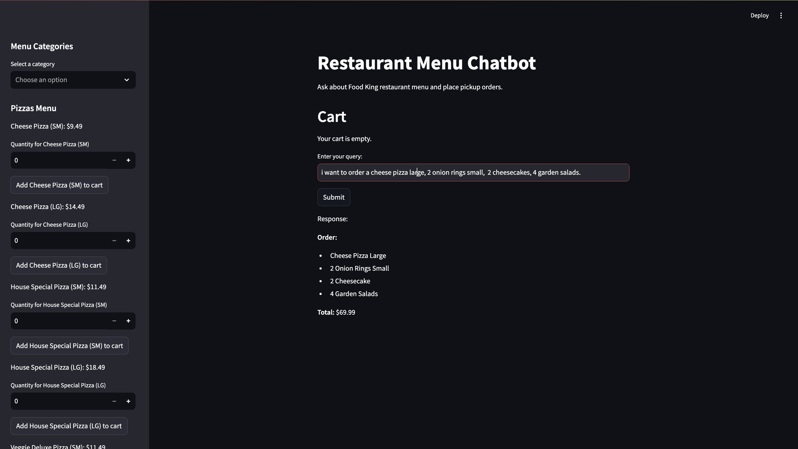
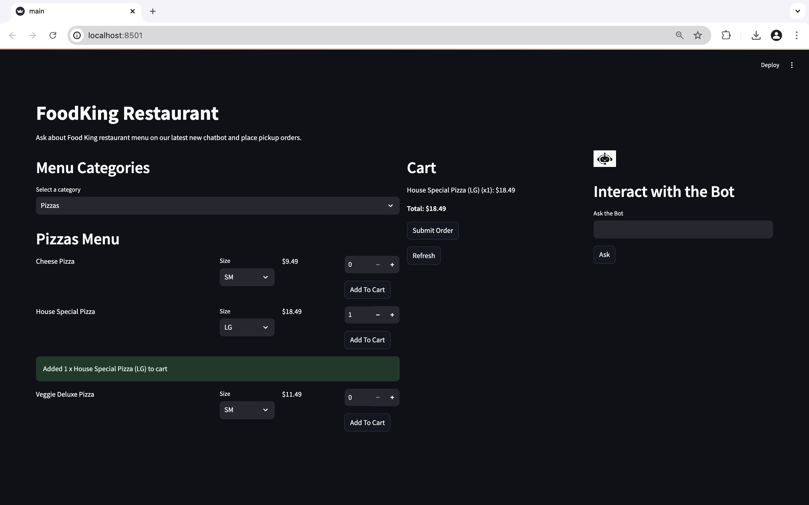
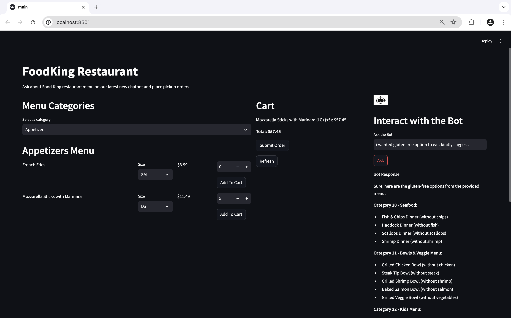
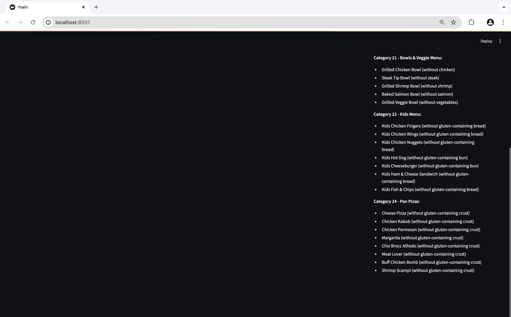

# Food King Restaurant App & Chatbot
This project is a Streamlit-based chatbot application that leverages the Ollama Gemma:2B model to provide information about the Food King restaurant menu and help users place pickup orders.

# Problem Statement
Food King restaurant is facing challenges in maintaining an updated and well-organized website. Due to the high volume of customers and limited technical expertise, the restaurant relies on staff to take orders and resolve support queries over the phone. To address these issues, I have been tasked with developing a chatbot that will streamline order placement and answer customer inquiries. This chatbot will be equipped to handle 23 different types of queries related to a comprehensive restaurant menu, which has been incorporated into the model to ensure it can accurately respond to customer questions and assist with placing orders.

Please note all this is performed on the MAC OS.

## Prerequisites
1. Docker 
2. Python 3.9 or higher
3. Streamlit
4. Requirements txt file

## Setup Instructions

### Step 1: Clone the Repository

```
git clone https://github.com/your-username/restaurant-menu-chatbot.git
```

```
cd restaurant-menu-chatbot
```

### Step 2: Set Up Docker Container for Ollama

Pull the Ollama Docker image:

```
docker pull ollama/ollama
```

Run the Docker container:

Open docker dameon. Run the following command in terminal.

```
docker run -d -v ~/.ollama:/root/.ollama -p 11434:11434 --name ollama ollama/ollama
```

### Step 3: Create the model (if not already created):

Prepare a Modelfile with the following content:

```
FROM gemma:2b

PARAMETER temperature 0.7

SYSTEM """
You are an assistant specialized in helping users with the FoodKing restaurant menu. Provide detailed information about the menu items, dietary options, and help place pickup orders.

Remember, SM means small and LG means large. If someone wants to order multiple items, respond with a confirmation message in a similar format to this sample: "Order placed for 2 small orders of Mozzarella Sticks with Ranch."

Here is the updated menu for FoodKing restaurant:

Pan Pizza:
1. Cheese Pizza
   - Pizza Sauce and Pizza Cheese.
   - Prices: $9.49 SM, $14.49 LG

2. House Special
   - Pizza Sauce, Pizza Cheese, Pepperoni, Sausage, Hamburg, Mushroom, Pepper, Onion, and Olives.
   - Prices: $11.49 SM, $18.49 LG

...

"""
```

Run the following commands to create and run the model:

```
ollama create foodking-assistant -f ./Modelfile
```

### Step 4:  Set Up the Python Environment

Create and activate a virtual environment:

```
python -m venv .venv
```

```
source .venv/bin/activate  # On Windows use `.venv\Scripts\activate`
```

Install the required Python packages:

```
pip install -r requirements.txt
```

OR

```
pip install streamlit requests beautifulsoup4
```

if you want to create a requirements.txt then run:

```
pip freeze > requirements.txt
```

### Step 5: Run the Streamlit Application

Create a Python file (app.py) with the following content:

```
import streamlit as st
```

```
import requests
```

```
import json
```

Function to get response from Ollama Gemma:2B : Refer the code provided in main.py

Streamlit app: Use streamlit to prepare your frontend which is available in main.py. 

```
streamlit run app.py
```

### Step 6: Access the Application

Open your web browser and navigate to http://localhost:8501 to interact with the Restaurant Menu Chatbot.

### Step 7: Troubleshooting
Ensure your Docker container is running and accessible at localhost:11434.
Verify that the API endpoint is working by sending a test request using curl or Postman.
Check Streamlit app logs in the terminal for any error messages or stack traces.
Ensure there are no network issues preventing your app from communicating with the Docker container.

```
git ls-tree -r -l HEAD | sort -k 4 -n -r | head -n 10
```

or restart youur streamlit app

### Step 7: Demonstration

Here you can see the menu is displayed and how the item is being ordered for the very first version.

<br>
</img>
<br>

The better version and interaction images are shared below:

1. Selecting food item, adding it to the cart and then showing the total amount.

<br>
</img>
<br>

2. Gemma response for an question asked by me about the food menu at FoodKing Restaurant.

<br>
</img>
<br>

<br>
</img>
<br>

For more information, checkout my youtube video: https://youtu.be/hNW7EwDtSws

### Step 8: Contact
For any questions or feedback, please contact me with the contact details given on my GITHUB repository.
