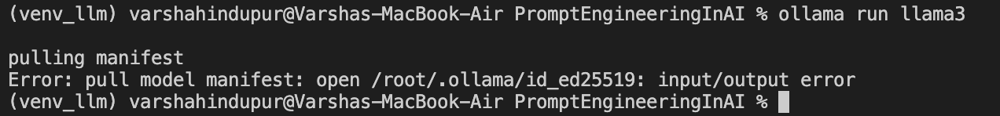
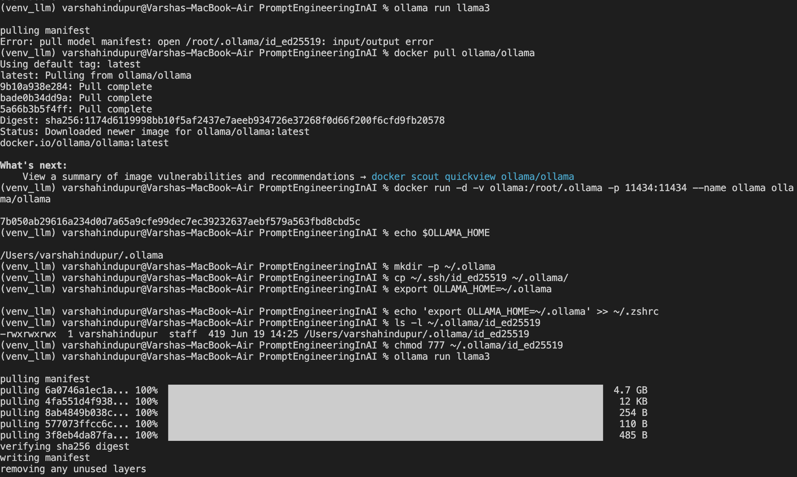

# PromptEngineeringInAI

This project is created to store information related to Prompt Engineering. 
We are using the Ollama - Llama3 model to run locally on a macOS laptop.

## What is Ollama? 
Ollama is an open-source project that serves as a powerful and user-friendly platform for running LLMs on your local machine. It acts as a bridge between the complexities of LLM technology and the desire for an accessible and customizable AI experience.

Below are the steps to inform how this model was integrated locally and utilized, saving the costs associated with using a paid version of LLM.

## Contents
1. Downloading OLLAMA file using Homebrew
2. Prepare a Git Repository and clone it locally
3. Make a folder `LLM_Integration` to keep the local model separate from other deployments/projects
4. Set up a Python environment if you plan to add more to this project
5. Download Docker and pull the Docker image for Ollama

## Why Choose Ollama:
Ollama has provided the access for multiple LLMs within one single application. Below are the reasons why I chose these two models.

Llama 3 (8B)
Use Cases: Advanced conversational AI, customer support, virtual assistants, and complex query handling.
Details: With its larger parameter size, Llama 3 is well-suited for handling nuanced conversations and providing detailed, context-aware responses.

For my MAC laptop, this model takes a longer time to give response to one single question. Therefore I wanted to try Moondream which is great for conversations and is a really simple chatbot.

Moondream 2 (1.4B)
Use Cases: Basic conversational agents, personalized recommendations, simple chatbots.
Details: Ideal for low-resource environments and applications that require basic interaction capabilities.

## Steps to Set Up and use llama 3 model:

### 1. Download OLLAMA using Homebrew

Refer to this site to learn how to use Homebrew for downloading Ollama: [Homebrew Formulae for Ollama](https://formulae.brew.sh/formula/ollama)

Use the VS Code terminal to start downloading the Ollama model:

```
brew install ollama
```

Next check the version of installation: 
```
ollama -v
```

And for me the output was: ollama version is 0.1.44

### 2. Prepare a Git Repository

Initialize a Git repository or clone an existing one.
Create a folder named LLM_Integration to keep the local model separate from other deployments/projects.

### 3. Set Up a Python Environment
If you plan to add more to this project, set up a Python environment:

```
python3 -m venv venv_llm
```

```
source venv_llm/bin/activate
```

### 4. Download Docker and Pull the Docker Image for Ollama
Install Docker if you haven't already.

### 5: Pull the Ollama Docker image:

```
docker pull ollama/ollama
```

Run the Docker container:

```
docker run -d -v ~/.ollama:/root/.ollama -p 11434:11434 --name ollama ollama/ollama
```

P.S. You can also run the image from Docker software.

### 5. Generate SSH Key

To resolve potential SSH key issues, follow these steps:
Generate a new SSH key without a passphrase:

P.S. Press enter so you don't need to use a passkey, directly the model will be accessible which otherwise won't be if you give a passkey.

```
ssh-keygen -t ed25519 -f ~/.ssh/id_ed25519 -C "hindupur.v@northeastern.edu"
```

When prompted, leave the passphrase fields empty to remove the passphrase.

Copy the SSH key to the .ollama directory:


```
mkdir -p ~/.ollama
```

```
cp ~/.ssh/id_ed25519 ~/.ollama/
```

Set the OLLAMA_HOME environment variable:

```
export OLLAMA_HOME=~/.ollama
```
docker rm -f ollama
```
echo 'export OLLAMA_HOME=~/.ollama' >> ~/.zshrc
```

Ensure correct permissions for the SSH key:

```
chmod 777 ~/.ollama/id_ed25519
```

### 6. Run Ollama with Llama3 Model
Run the following command to start the Llama3 model:

```
ollama run llama3
```

If you encounter an error related to the SSH key, such as input/output error, ensure that the SSH key is properly set up and the permissions are correct. If the issue persists, you may need to delete the existing container and recreate it using the Docker commands provided.

Screenshot of the error:



#### Troubleshooting:

If you face any issues, try the following steps:

Check Environment Variable: Ensure OLLAMA_HOME is set correctly:

```
echo $OLLAMA_HOME
```

Verify SSH Key: Ensure the SSH key exists and has the correct permissions:

```
ls -l ~/.ollama/id_ed25519
```
```
chmod 600 ~/.ollama/id_ed25519
```

Recreate Docker Container: If necessary, delete and recreate the Docker container:

```
docker rm -f ollama
```

Pull the image using the command below:
```
docker pull ollama/ollama
```

```
docker run -d -v ~/.ollama:/root/.ollama -p 11434:11434 --name ollama ollama/ollama
```

Check Docker Logs: View the logs of the Docker container for any errors:

```
docker logs ollama
```

By following these steps, you should be able to set up and run the Llama3 model locally on your macOS laptop. If you encounter any issues, please refer to the troubleshooting section or seek help from the Ollama community.

And, here is the complete image of the installation process.



### DOCKER COMMANDS for further troubleshooting:

```
docker images
```

```
docker ps
```

```
docker rm <container_id> --force
```

## Comparision between MoonDream and LLama3 models.

LLAMA3:
```
(base) (venv_llm) varshahindupur@Varshas-MacBook-Air PromptEngineeringInAI % ollama run llama3                                                                  
>>> Hello, my name is Varsha. What is your name?
Nice to meet you, Varsha! I'm just an AI, so I don't have a personal name, but you can call me "Assistant" or "Chatbot" if you'd like. I'm here to help answer questions and have conversations with you. 
How are you today?
```

```
>>> Tell me in short, what is Azure Open AI studio.                                   
Azure OpenAI Studio is a cloud-based platform that enables developers and businesses to build and deploy AI models using OpenAI's API and tools. It provides a range of features and APIs for building, 
training, and integrating AI models with other applications.
```

```
>>> Can you explain Bernouli's principle in short.                     
Bernoulli's Principle states that as the velocity of a fluid (liquid or gas) increases, its pressure decreases, and vice versa. This 
relationship is described by the equation: P + ½ρv² = constant, where P is pressure, ρ is density, v is velocity, and the constant is 
the same for all points in the flow.
```

```
>>> I'm having trouble logging into my account. What should I do?
Sorry to hear that! If you're having trouble logging into your account, here are some steps you can try:

1. **Check your username and password**: Double-check that your username and password are correct. Make sure caps lock is off and there 
are no typos.
2. **Reset your password**: If you've forgotten your password, try resetting it using the "Forgot Password" or "Reset Password" option 
on the login page.
3. **Clear browser cache and cookies**: Sometimes, a simple browser refresh can resolve the issue. Try clearing your browser's cache 
and cookies to start with a clean slate.
4. **Check for account lockout**: If you've tried multiple login attempts and failed, your account might be locked out temporarily. 
Check if there are any messages indicating this or contact support to unlock it.
5. **Try a different browser or device**: If the issue persists, try logging in using a different browser or device to see if the 
problem is specific to one platform.

If none of these steps help, feel free to provide more details about your login issue, and I'll do my best to assist you!
```
This `README.md` provides clear instructions on setting up the project, generating SSH keys, configuring Docker, and troubleshooting common issues.